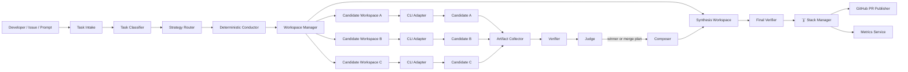
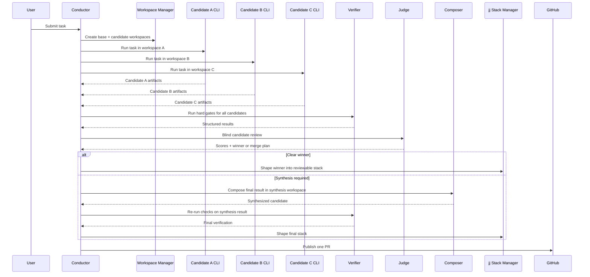
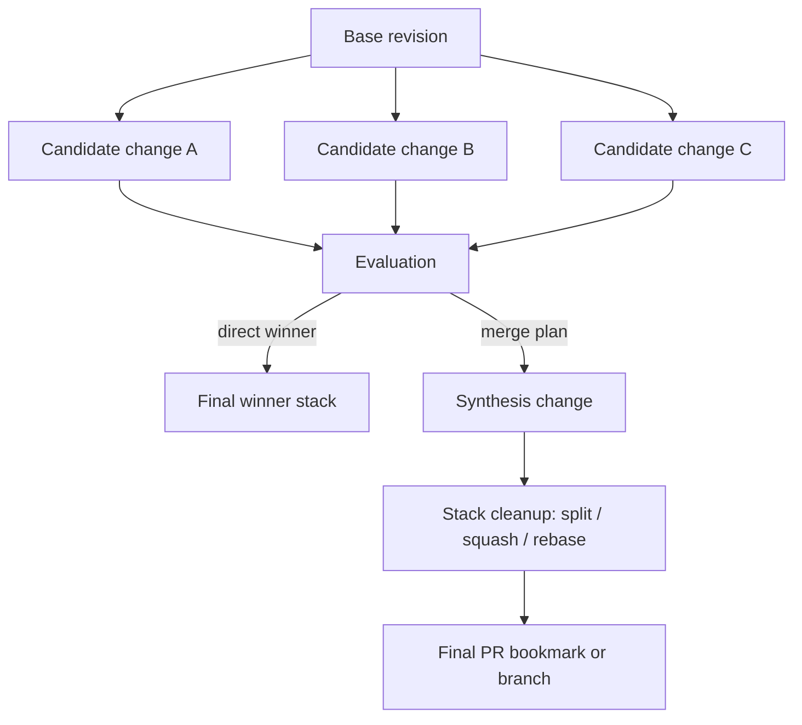
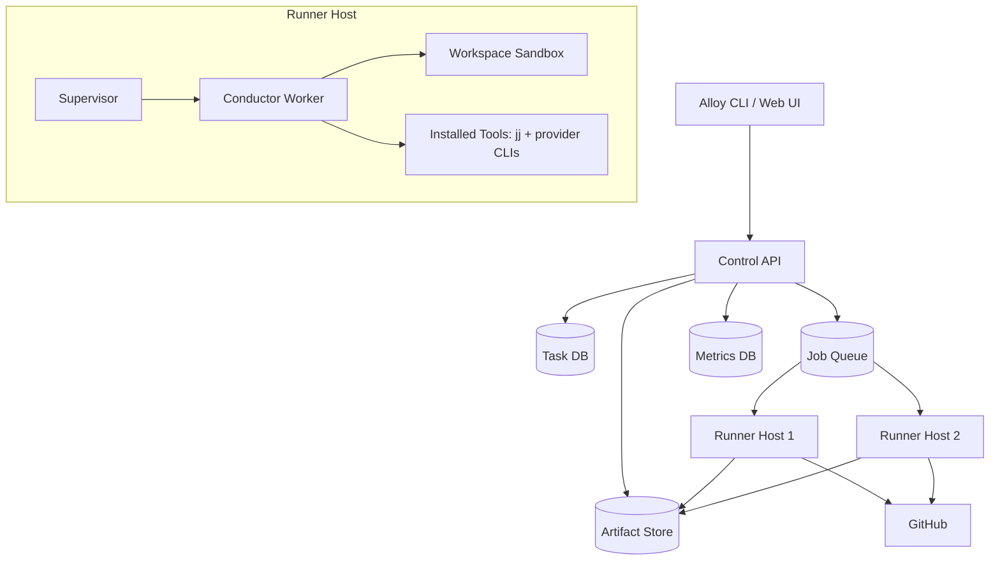

# Alloy Implementation Plan

Status: Draft for implementation
Authoring date: March 8, 2026
Primary objective: Build a Symphony-inspired orchestration system that uses multiple official coding CLIs authenticated via web-account subscriptions, evaluates candidate code changes objectively, synthesizes the best result with `jj`, and publishes a single clean pull request.

Runtime stance:
- Alloy is currently being implemented as an Alloy-native Node system.
- Symphony is the workflow/model inspiration and demo-shell reference point, not a mandatory runtime dependency in the MVP.
- Pulling in Symphony's Elixir runtime is a later optional integration decision, not a current implementation prerequisite.

Related design docs:
- `docs/DEMO_AND_OPERATOR_EXPERIENCE.md` for the first demo task, task input contract, operator steering model, GUI surfaces, and monitoring requirements
- `docs/TASK_BRIEF_SCHEMA_AND_PARSER.md` for the Markdown task format, normalized JSON contract, parser behavior, and validation rules
- `docs/GUI_WIREFRAMES.md` for the first operator-facing GUI wireframes and screen-level requirements
- `docs/SYMPHONY_MANAGER_INTEGRATION.md` for the first-demo requirement that tasks/cards live in a Symphony-style manager while Alloy supplies judging and synthesis
- `docs/ADAPTERS_AND_RUNNER.md` for the current CLI adapter defaults, event model, workspace seeding behavior, and next runner steps
- `docs/AUTH_AND_LOGIN.md` for CLI-first provider authentication handling and the GUI login-repair flow
- `docs/RUNTIME_AND_AUTH_ARCHITECTURE.md` for provider login state, session orchestration, PTY usage, and GUI/API runtime control
- `docs/JJ_AND_EVALUATION.md` for the currently implemented `jj` bootstrap flow, candidate patch capture, deterministic scorecard, and winner/synthesize decision output
- `docs/PUBLICATION_FLOW_PLAN.md` for the next-step publication preview, approval, and push-preparation workflow
- `docs/TWO_WEEK_BUILD_ORDER.md` for the concrete 10-working-day demo build sequence
- `docs/MILESTONE_CHECKLIST.md` for execution checklists across the first Alloy milestones
- `docs/SYMPHONY_FORK_VS_BUILD_FRESH.md` for the decision split between reusing Symphony and building Alloy-native systems

## 1. Summary

Current implementation status:
- tic-tac-toe is now the default first demo card
- operator run-config overrides are implemented in the web shell
- candidate runs are session-backed and persisted
- each candidate workspace is bootstrapped as a `jj` repo with a base snapshot
- candidate patches and changed-file metadata are captured after runs
- deterministic evaluation now produces winner vs synthesize recommendations
- judge/composer and final `jj` synthesis stack assembly are still upcoming

Alloy is the recommended product name. `stack-judge` is the current working codename and can remain as a temporary internal repository slug during early development.

Alloy is a multi-agent code orchestration system. It runs several coding agents from different providers against the same software task in isolated workspaces, captures each candidate's output as a versioned change, evaluates the candidates with deterministic checks plus blind rubric-based review, synthesizes the best parts of multiple candidates when beneficial, and produces one final pull request.

The product is explicitly designed to maximize ROI from subscription-based coding tools rather than API-token billing. The MVP should rely on official provider CLIs authenticated through interactive web-account login flows and avoid direct API-key management.

### 1.1 Recommended Naming

Recommended public product name:
- `Alloy`

Recommended repository slug:
- `alloy`

Recommended package/service naming:
- umbrella concept: `alloy`
- orchestration service: `conductor`
- worker runtime: `runner`
- merge/eval subsystem: `stack_judge`

Rationale:
- `Alloy` signals synthesis: multiple strong ingredients combined into one stronger final result.
- The name emphasizes merge quality rather than simple model competition.
- `alloy` is short, ownable, and aligns with the product's central technical idea.

### 1.2 Naming Rules

- Do not ship under the name `Symphony` or any vendor-branded derivative likely to create trademark confusion.
- Preserve a clean distinction between the product name and internal service/package names.
- Keep provider names out of the product brand because provider mix may change over time.
- Prefer names and docs that emphasize synthesis and outcome quality.

## 2. Core Principles

1. The conductor owns process flow.
2. Agents generate or review code; they do not control Git history.
3. Every candidate must be reproducible from a known base revision.
4. Shared mutable workspaces are forbidden.
5. Deterministic checks outrank model opinions.
6. Evaluation must be blind to provider identity.
7. Synthesis should be conservative and reviewable.
8. `jj` is the system of record for change provenance and merge orchestration.
9. The system must learn routing and ROI over time.
10. The final artifact is always one clean PR.

## 3. Product Goals

### 3.1 Primary Goals

- Use multiple official coding CLIs through subscription-authenticated accounts.
- Demonstrate the system with all three major-lab CLI agents: `codex`, `gemini`, and `claude-code`.
- Use a Symphony-style task manager as the primary demo shell so humans interact with cards/tasks rather than raw runner commands.
- Surface provider install/login state clearly and let humans repair missing or expired CLI sessions from the product flow.
- Orchestrate isolated candidate implementations for one task.
- Evaluate candidates objectively with tests and structured review.
- Merge the best aspects of multiple candidates when beneficial.
- Shape the final output into a reviewable `jj` change stack.
- Publish one GitHub pull request.
- Measure provider contribution, latency, and cleanup burden.
- Make human steering, live monitoring, and decision transparency first-class product capabilities.

### 3.2 Non-Goals For MVP

- Fine-grained hunk-splicing across arbitrary conflicts.
- Provider SDK integrations or API-key billing.
- Full SaaS multi-tenant control plane.
- In-browser IDE/editor.
- Automatic production deployment.
- Replacing human code review.

## 4. Constraints

### 4.1 Provider Constraint

The MVP and demo should use official CLIs authenticated via user web accounts or enterprise seats. The initial implementation should not require provider API keys or bill against provider API token usage.

Future option:
- provider API-backed adapters may be added later behind a separate adapter interface if product goals change
- API-backed adapters are explicitly out of MVP scope

### 4.1.1 Demo Provider Constraint

The end-to-end demo should include all three major-lab CLI agents:
- `codex`
- `gemini`
- `claude-code`

Each must run via a locally installed official CLI and an authenticated local account session.

### 4.2 Version Control Constraint

All candidate and synthesized changes should be represented in `jj`. The conductor owns `jj` commands and all publishing actions.

### 4.3 Workspace Constraint

Each agent runs in an isolated writable workspace rooted from the same base revision. A shared read-only reference checkout is acceptable; a shared writable workspace is not.

### 4.4 Evaluation Constraint

Provider identity must be hidden from the judge during candidate scoring.

### 4.5 Licensing and Forkability Constraint

This section is an engineering interpretation of publicly posted licenses as of March 8, 2026. It is not legal advice. Before redistribution, commercial packaging, or managed-hosted deployment, legal review should confirm the final dependency plan.

| Dependency | Current license signal | Forkable? | Safe to redistribute in-product? | Recommended treatment |
| --- | --- | --- | --- | --- |
| `openai/symphony` | Apache License 2.0 | Yes | Yes, with Apache 2.0 obligations | Acceptable as a fork/base, preserve license and notices |
| `jj-vcs/jj` | Apache License 2.0 | Yes | Yes, with Apache 2.0 obligations | Acceptable as dependency or fork; CLI integration preferred first |
| `openai/codex` | Apache License 2.0 | Yes | Technically yes under Apache 2.0, but product/auth behavior may diverge from upstream if forked | Prefer invoking the official installed CLI rather than maintaining a fork |
| `google-gemini/gemini-cli` | Apache License 2.0 | Yes | Technically yes under Apache 2.0 | Prefer invoking the official installed CLI rather than maintaining a fork |
| `anthropic/claude-code` or equivalent official Claude Code distribution | Proprietary commercial terms, all rights reserved | No | No, unless separately permitted by Anthropic | Treat as an external tool only; do not fork, vendor, or redistribute |

Required Apache 2.0 hygiene:
- retain the upstream license text
- preserve required notices and attributions
- mark modified files clearly when redistributing derivatives
- avoid using upstream trademarks as your product name

Recommended packaging policy:
- fork `Symphony` only if the code meaningfully accelerates development
- depend on `jj` as an external CLI for MVP, even though it is forkable
- invoke provider CLIs as external system tools instead of bundling them into Alloy
- treat proprietary CLIs as optional external integrations discovered at runtime
- leave room in the architecture for future API-backed adapters without making them part of MVP

### 4.6 Dependency Policy

There should be three dependency classes:

1. Forkable source dependencies
- Example: `openai/symphony`, `jj`
- Allowed actions: fork, patch, vendor, redistribute under license terms

2. Open-source external tool dependencies
- Example: official `codex` and `gemini` CLI installs
- Allowed actions: invoke at runtime, pin supported versions, optionally inspect source for compatibility
- Preferred action: do not maintain product forks unless absolutely necessary

3. Proprietary external tool dependencies
- Example: `claude-code`
- Allowed actions: detect, invoke, health-check
- Forbidden actions: vendor, fork, redistribute, present as bundled functionality

## 5. Working Mental Model

The system is not "three coders on one branch." It is:

- one deterministic conductor
- N isolated candidate producers
- one judge
- one composer
- one verifier
- one `jj` stack manager
- one PR publisher

In many tasks, the best result will be one winner. In some tasks, the best result will be a synthesis of the strongest candidate logic, tests, and cleanup.

## 5.1 Product Positioning

Alloy is not primarily a leaderboard for model rivalry. It is a synthesis system focused on merging the strongest output from multiple agents into one better pull request.

Product thesis:
- Alloy improves code quality and subscription ROI by combining the strongest contributions from Codex, Gemini, and Claude Code.

## 6. High-Level Architecture

## 6.1 Core Services

### Task Intake
Receives a task from CLI, issue tracker, prompt, or repository command.

Responsibilities:
- parse task metadata
- bind repository and target branch
- assign task ID
- persist initial request

### Task Classifier
Classifies the task to determine strategy and scoring weights.

Outputs:
- task type
- risk level
- expected file domains
- recommended mode: fast, race, relay, committee

### Strategy Router
Chooses which providers participate and how.

Responsibilities:
- choose agent set
- choose execution mode
- select scoring profile
- set cost/latency guardrails

### Workspace Manager
Creates and manages base and derived workspaces.

Responsibilities:
- prepare repo snapshot
- create candidate workspaces
- create synthesis workspace
- clean or archive completed workspaces

### CLI Adapter Layer
Normalizes subprocess-driven provider CLIs behind one contract.

Responsibilities:
- verify login availability
- run tasks in non-interactive or controlled PTY mode
- capture output streams and artifacts
- enforce execution constraints

### Artifact Collector
Normalizes run outputs across providers.

Responsibilities:
- compute changed files
- collect diff/patch
- save transcript and metadata
- record timing and exit status

### Verifier
Runs deterministic validation.

Responsibilities:
- build
- tests
- lint
- typecheck
- task-specific acceptance checks
- policy/security checks

### Judge
Reviews candidates blind and emits structured scores.

Responsibilities:
- score candidates against rubric
- perform pairwise comparisons
- identify complementary strengths
- decide winner versus synthesis recommendation

### Composer
Integrates the best pieces into a final synthesis candidate.

Responsibilities:
- read judge merge plan
- construct final patch in synthesis workspace
- resolve overlap conservatively
- prepare reviewable stack shape

### Stack Manager
Uses `jj` to manage change provenance and PR-ready history.

Responsibilities:
- create one change per candidate
- split/squash/rebase synthesized result
- keep final stack reviewable
- map `jj` state to Git/GitHub publishing

### PR Publisher
Pushes final result and opens/updates one pull request.

Responsibilities:
- create branch/bookmark mapping
- push final stack
- create PR body from task + scorecard + summary

### Metrics Service
Stores performance and ROI data.

Responsibilities:
- track winner rate
- track contribution rate
- track latency
- track human cleanup burden
- track post-merge regressions if available

## 6.2 Logical Data Flow

1. Task intake receives a task.
2. Classifier labels the task.
3. Router chooses execution mode and participating agents.
4. Workspace manager creates candidate workspaces.
5. CLI adapters run candidates.
6. Artifact collector snapshots outputs.
7. Verifier runs deterministic checks.
8. Judge scores candidates blind.
9. Conductor chooses winner or synthesis.
10. Composer builds final result if needed.
11. Verifier reruns checks on final result.
12. Stack manager shapes `jj` history.
13. PR publisher opens one PR.
14. Metrics service records outcome.

## 6.3 Architecture Diagrams

### System Overview



### Candidate Race And Synthesis Sequence



### `jj` Provenance And Publication Model



### Production Deployment Topology



### Production Interpretation

- Start with a single-node deployment where control API, queue, runner, and artifact storage can live on one machine.
- Keep provider CLIs installed on runner hosts, not embedded in application containers.
- Treat provider login health as part of runner readiness.
- Split the runner from the control plane only when concurrency or isolation pressure demands it.
- Make artifacts durable enough that failed tasks can be inspected and resumed.

## 6.4 Production Readiness Requirements

Alloy should be designed for eventual production use even if implementation starts locally.

Operational requirements:
- explicit preflight checks for installed CLIs and active logins
- queue-based task execution rather than in-request long-running jobs
- durable artifact storage for transcripts, diffs, and verification output
- resumable task state machine
- runner host isolation and cleanup
- per-provider concurrency limits
- structured audit logs for every orchestration decision
- degraded mode when one provider becomes unavailable

Initial deployment recommendation:
- monolith control plane plus local worker runtime
- external PostgreSQL or SQLite for metadata
- filesystem or object storage for artifacts
- GitHub as external publication target
- `jj` and provider CLIs installed on workers through bootstrap scripts

## 7. Execution Modes

### 7.1 Fast Mode
Use one preferred provider and optionally one reviewer.

Use when:
- task is small
- repo area is low-risk
- past routing data shows a clear favorite

### 7.2 Race Mode
Multiple providers implement independently in parallel.

Use when:
- task is ambiguous
- correctness matters more than latency
- bug is hard to localize
- change is architecturally meaningful

### 7.3 Relay Mode
Agents collaborate sequentially rather than independently.

Example:
- Agent A drafts implementation
- Agent B critiques and patches
- Agent C adds tests and edge cases

Use when:
- likely best ROI is sequential improvement
- one provider is better at drafting than polishing

### 7.4 Committee Mode
Finalists are re-evaluated and merged cautiously.

Use when:
- multiple strong candidates survive
- strengths are complementary
- task is risky enough to justify synthesis

## 8. Provider Model

The conductor should treat providers as interchangeable candidate generators and reviewers, subject to per-provider strengths learned over time.

Initial assumption set for the demo:
- Codex CLI is likely strong for direct implementation and codebase-aware edits.
- Claude Code is likely strong for structured review, judging, and synthesis due to strong automation ergonomics.
- Gemini CLI is likely useful as a divergent candidate generator and critique source.

This is a starting hypothesis only. Production routing should be driven by observed repo-specific results.

Demo requirement:
- the first end-to-end demonstration should exercise `codex`, `gemini`, and `claude-code` on the same task and show either direct winner selection or synthesized merge output

## 9. CLI Adapter Design

## 9.1 Adapter Contract

Each adapter should implement:

- `health_check()`
- `login_status()`
- `prepare(task, workspace, constraints)`
- `run()`
- `stream_events()`
- `collect_result()`
- `shutdown()`

## 9.2 Normalized Result Shape

Each run should produce:

- candidate ID
- task ID
- provider ID
- agent binary/version
- workspace path
- base revision
- start/end timestamps
- exit status
- stdout/stderr transcript paths
- changed file list
- diff patch path
- summary text
- optional structured usage metadata

## 9.3 Execution Strategy

Adapters should prefer official non-interactive modes when available. If a provider CLI requires a PTY for stable behavior, wrap it in a controlled pseudo-terminal session and capture the transcript.

## 9.4 Failure Handling

Possible failure classes:
- not logged in
- login expired
- provider rate limit / quota ceiling
- CLI crash
- malformed output
- workspace corruption

Each failure must be surfaced as structured state so the conductor can degrade gracefully.

## 10. Workspace and `jj` Strategy

## 10.1 Repository Layout

Suggested top-level local working layout:

```text
alloy/
  runs/
    <task-id>/
      base/
      candidates/
        codex/
        claude/
        gemini/
      synthesis/
      artifacts/
      logs/
```

This layout is a runner cache. The actual implementation repo under evaluation may live elsewhere or may be cloned per task.

## 10.2 `jj` Lifecycle Per Task

1. Prepare base repo snapshot at target revision.
2. Create a `jj` workspace or branch context for each candidate.
3. Run each agent in its candidate workspace.
4. Record resulting candidate diff as its own `jj` change.
5. Evaluate candidates.
6. Create fresh synthesis workspace.
7. Build final merged result as new `jj` change(s).
8. Split/squash/rebase to produce reviewable stack.
9. Push bookmark/branch for PR publication.

## 10.3 `jj` Roles

Use `jj` for:
- provenance
- rebasing candidates to common base
- splitting large synthesized results into reviewable commits
- squashing noisy fixups
- producing clean publication history

Do not use `jj` as a replacement for evaluation logic.

## 10.4 Provenance Requirement

Every final stack should preserve metadata about which candidate contributed which part. Even if not exposed directly in the Git commit graph, provenance should remain available in task artifacts.

## 11. Candidate Evaluation Framework

## 11.1 Evaluation Stages

### Stage 0: Task Classification
Classify task and select scoring weights.

### Stage 1: Hard Gates
Run deterministic checks. Any major failure blocks outright victory.

### Stage 2: Rubric Scoring
Judge reviews candidates against a fixed scoring rubric.

### Stage 3: Pairwise Comparison
Judge compares finalists head-to-head.

### Stage 4: Contribution Extraction
Judge identifies which candidate has the best logic, tests, structure, cleanup, docs, etc.

### Stage 5: Winner or Synthesis Decision
Conductor applies selection rules.

### Stage 6: Final Verification
If synthesis occurs, rerun deterministic checks on final result.

## 11.2 Hard Gates

Suggested hard gates:
- repo checkout successful
- no unresolved merge or workspace errors
- project build passes
- relevant test suite passes
- lint passes
- typecheck passes
- no forbidden files modified
- no secrets detected
- no dangerous commands outside policy

Failure policy:
- a candidate failing build/tests cannot win outright
- a failing candidate may still contribute salvageable material such as tests or docs if explicitly approved by synthesis logic

## 11.3 Rubric Categories

Default scoring out of 100:

- correctness: 40
- acceptance/spec coverage: 20
- maintainability: 15
- safety/risk: 10
- test quality: 10
- minimality/focus: 5

Task-specific profiles may reweight these.

Examples:
- bugfix: correctness and tests get extra weight
- refactor: maintainability and minimality get extra weight
- migration: safety and acceptance coverage get extra weight

## 11.4 Pairwise Comparison Prompts

The judge should answer, for each pair:
- which candidate is more likely correct
- which is safer to merge
- which is easier for humans to review
- which has stronger tests
- whether one candidate contains unique value worth salvaging

## 11.5 Selection Rules

Suggested initial rules:

- one candidate passes all hard gates and leads by 12 or more points: direct winner
- top two candidates within 8 points and strengths differ materially: synthesize
- top candidate best overall but second has clearly stronger tests: synthesize tests into winner if feasible
- candidates conflict heavily in same risky files: prefer single winner unless judge emits explicit safe merge plan

## 11.6 Confidence Model

Confidence levels:
- high: clear winner and all checks pass
- medium: winner selected but margin is narrow
- low: synthesis required or judge disagreement exists

Low-confidence outcomes should trigger stricter human review and optional second-opinion judging.

## 12. Judge Design

## 12.1 Blind Evaluation

The judge must not know provider identity.

Artifacts shown to the judge should be normalized to:
- Candidate A
- Candidate B
- Candidate C

Order should be randomized per run.

## 12.2 Primary Judge Responsibilities

The judge should output structured JSON only, including:
- rubric scores
- pairwise winners
- contribution map
- overall recommended winner
- whether synthesis is recommended
- merge plan if synthesis is recommended
- confidence
- rationale

## 12.3 Tie-Breaker Strategy

When outcomes are close or low confidence:
- run a second judge pass
- if judges disagree, prefer deterministic signals and lower-risk candidate

## 12.4 Judge Safety Rules

The judge should not execute repo mutations. It is a read-and-decide role, not a coding role.

## 13. Composer Design

## 13.1 Composer Inputs

The composer should receive:
- task description
- final shortlisted candidate diffs
- contribution map
- explicit merge plan
- repo base revision
- constraints on touched files if any

## 13.2 Composer Output

The composer produces one synthesized candidate in a fresh synthesis workspace.

Required characteristics:
- no provider identity leakage in final summary
- minimal additional scope creep
- preference for file-level or module-level composition
- no speculative rearchitecture beyond task requirements

## 13.3 Conservative Merge Policy

Prefer merge operations in this order:
1. whole candidate winner
2. file-level selection
3. symbol-level synthesis where safe
4. hunk-level synthesis only as a later advanced feature

## 13.4 Retry Policy

If synthesized result fails verification:
- allow one repair attempt using explicit failure reports
- if still failing, fall back to the safest viable winner

## 14. Metrics and ROI Framework

The system exists partly to maximize ROI from multiple subscriptions. That means it must learn where each provider actually adds value.

## 14.1 Metrics To Track

Per task, per provider, per task class:
- participation rate
- hard-gate pass rate
- outright win rate
- contribution rate to final synthesis
- average time to first viable candidate
- average time to green final result
- human cleanup minutes after selection
- regression rate after merge if available
- changed-file concentration
- proportion of useful test contributions

## 14.2 Marginal Contribution

Track marginal lift, not only winner frequency.

Questions to answer over time:
- Does provider X improve final quality when paired with provider Y?
- Does provider Z only add value on frontend tasks?
- Is a given provider worth keeping for testing and critique even if it rarely wins implementation?

## 14.3 Routing Feedback Loop

Over time, the router should learn:
- which providers to use for each task class
- when to skip full race mode
- when relay mode beats race mode
- when synthesis is worth the latency cost

## 15. Data Model

## 15.1 Task

```json
{
  "task_id": "task_20260308_001",
  "repo": "org/repo",
  "base_revision": "<git-or-jj-id>",
  "title": "Fix flaky cache invalidation bug",
  "description": "...",
  "task_type": "bugfix",
  "risk_level": "medium",
  "mode": "race",
  "status": "running"
}
```

## 15.2 Candidate

```json
{
  "candidate_id": "cand_a",
  "task_id": "task_20260308_001",
  "provider": "hidden_at_judge_time",
  "display_slot": "A",
  "workspace_path": "/abs/path/to/workspace",
  "jj_change_id": "abc123",
  "base_revision": "<git-or-jj-id>",
  "status": "completed",
  "started_at": "2026-03-08T12:00:00Z",
  "completed_at": "2026-03-08T12:09:30Z",
  "changed_files": ["src/cache.ts", "test/cache.test.ts"],
  "artifacts": {
    "patch_path": "/abs/path/to/patch.diff",
    "stdout_path": "/abs/path/to/stdout.log",
    "stderr_path": "/abs/path/to/stderr.log",
    "summary_path": "/abs/path/to/summary.md"
  }
}
```

## 15.3 Verification Result

```json
{
  "candidate_id": "cand_a",
  "build": "pass",
  "tests": "pass",
  "lint": "pass",
  "typecheck": "pass",
  "policy": "pass",
  "notes": []
}
```

## 15.4 Judge Output

```json
{
  "task_id": "task_20260308_001",
  "candidate_scores": {
    "A": {
      "correctness": 36,
      "acceptance_coverage": 18,
      "maintainability": 13,
      "safety": 9,
      "test_quality": 9,
      "minimality": 4,
      "total": 89
    },
    "B": {
      "correctness": 34,
      "acceptance_coverage": 17,
      "maintainability": 14,
      "safety": 8,
      "test_quality": 10,
      "minimality": 5,
      "total": 88
    }
  },
  "pairwise": [
    {"left": "A", "right": "B", "winner": "A", "reason": "better core fix"}
  ],
  "contribution_map": {
    "best_core_logic": "A",
    "best_tests": "B",
    "best_cleanup": "A"
  },
  "winner": "A",
  "should_synthesize": true,
  "merge_plan": [
    "Take core implementation from A",
    "Take new regression tests from B",
    "Keep A's public API shape"
  ],
  "confidence": "medium",
  "rationale": "A is stronger overall but B contributes the stronger regression suite."
}
```

## 16. Repository and Module Structure

A plausible codebase layout for a new fork or greenfield project:

```text
alloy/
  apps/
    conductor/
    worker/
  lib/
    stack_judge/
      tasks/
      routing/
      workspaces/
      adapters/
      artifacts/
      verify/
      judge/
      compose/
      vcs/
      metrics/
      github/
  config/
  scripts/
  docs/
  test/
```

If forking Symphony, preserve only the pieces aligned to orchestration, workspace handling, and GitHub integration. The rest should be adapted to candidate-based rather than single-agent task flow.

## 17. Symphony Fork Strategy

Symphony is useful as inspiration and possibly as a partial base for:
- task orchestration
- workspace isolation
- GitHub integration
- process supervision
- task board and card-based operator experience

### 17.1 Demo Requirement

For the first public demo, Symphony should not remain a backstory only. The demo should expose tasks as cards inside a Symphony-style manager surface and let users launch Alloy runs, inspect candidate progress, review synthesis plans, and publish PRs from that task context.

Practical implication:
- the first demo UX should feel like \"task cards in a manager\" with Alloy status layered onto each card
- Alloy should provide the adjudication and synthesis engine behind that surface
- future implementation can either fork Symphony's manager UI directly or recreate the same board/detail interaction pattern while preserving license hygiene

Required conceptual changes:
- move from one task -> one agent result
- to one task -> many candidates -> evaluated selection -> final synthesis

Key refactor targets:
- workspace manager becomes multi-candidate aware
- task state model gains candidate lifecycle tracking
- evaluation pipeline is first-class rather than an afterthought
- publishing step consumes synthesized output, not raw agent result

## 18. Security and Policy

### 18.1 Provider Authentication

The MVP should not require stored provider API keys because the chosen model is subscription-authenticated CLI use. It may, however, need to check that local provider CLIs are logged in and healthy.

### 18.2 Secret Handling

- scan outputs for secrets before publishing
- disallow modifying protected config unless task explicitly allows it
- record executed commands where possible

### 18.3 Sandboxing

Prefer constrained subprocess execution and per-workspace policy guards. Do not grant coding agents arbitrary authority over host-wide state.

## 19. Human Review Policy

Humans remain the final safety boundary.

Recommended triggers for stronger human review:
- low judge confidence
- synthesis touched critical paths
- candidate disagreement in security-sensitive files
- large schema or migration changes
- deterministic checks required retries

## 20. MVP Roadmap

## Milestone 0: Platform Setup And Runner Bootstrap

Deliverables:
- macOS setup guide
- Linux setup guide
- bootstrap preflight checklist
- documented install and login expectations for `jj`, `codex`, `claude-code`, and `gemini`
- clear statement of which tools are bundled versus externally installed

Success criteria:
- a new engineer can prepare a supported macOS or Linux machine using only project docs
- runner hosts can pass a preflight check for Git, Node, `jj`, and provider CLI availability
- provider login health is documented as a required runtime condition

## Milestone 1: Local Single-Repo Orchestrator

Deliverables:
- task runner for one local repo
- one provider adapter
- one workspace per run
- deterministic verification
- final diff export
- initial Symphony-style card shell or stub board view in demo UX plan

Success criteria:
- can run one agent against one task and capture artifacts reproducibly
- can represent that task as a card with launchable run state in the planned demo shell

## Milestone 2: Multi-Candidate Race Mode

Deliverables:
- three provider adapters or stubs
- parallel candidate workspaces
- normalized artifacts
- hard-gate verifier

Success criteria:
- can run at least two providers in isolation on same task and compare outputs

## Milestone 3: Blind Judge

Deliverables:
- candidate anonymization
- structured rubric scoring
- pairwise comparison engine
- winner-selection logic

Success criteria:
- system can pick a winner reproducibly from two or three candidates

## Milestone 4: `jj` Synthesis Flow

Deliverables:
- candidate changes represented in `jj`
- synthesis workspace
- file-level merge flow
- final stack shaping with split/squash/rebase

Success criteria:
- system can synthesize tests from one candidate into winner candidate and produce a clean final stack

## Milestone 5: GitHub PR Publication

Deliverables:
- push final bookmark/branch
- open or update PR
- include judge summary and verification report

Success criteria:
- one task results in one reviewable PR

## Milestone 6: ROI Learning Loop

Deliverables:
- metrics persistence
- provider/task-class dashboard
- routing heuristics based on observed outcomes

Success criteria:
- system can recommend which providers to invoke for a given task class based on prior data

## 21. Acceptance Criteria

A task is considered successfully handled when:
- candidate runs were reproducible from one base revision
- all artifacts were captured
- winner or synthesis decision was recorded with rationale
- final result passed deterministic checks
- final `jj` stack was reviewable
- one PR was published or ready to publish
- metrics were persisted for future routing

## 22. Risks and Mitigations

### Risk: CLI automation instability
Mitigation:
- build adapter-specific health checks
- support PTY fallback
- support degraded mode when a provider is unavailable

### Risk: judge bias
Mitigation:
- blind evaluation
- randomized candidate ordering
- optional second-opinion judge

### Risk: synthesis complexity explodes
Mitigation:
- start with winner-takes-all
- add file-level synthesis only after reliable scoring
- delay hunk-level synthesis

### Risk: subscription login/session churn
Mitigation:
- add preflight login status checks
- surface reauth requirements early
- cache health state per provider

### Risk: final history becomes unreadable
Mitigation:
- make stack shaping a first-class step
- use `jj split`, `jj squash`, and `jj rebase` to keep final PR reviewable

### Risk: false confidence from LLM judge
Mitigation:
- deterministic checks outrank model opinions
- low-confidence tasks receive stricter review
- log evaluation rationales for auditability

## 23. Open Questions

1. Which language/runtime should own the first implementation: Elixir fork of Symphony, or greenfield service with only selected Symphony ideas?
2. Which provider CLI offers the most reliable structured non-interactive behavior in the target environment?
3. Which test scopes are affordable enough to run for every candidate versus finalists only?
4. Should synthesis be allowed to introduce new code not present in any finalist, or only rearrange finalist contributions?
5. How should long-running tasks be checkpointed and resumed?
6. How aggressively should the router optimize for latency versus quality?
7. Which repositories will serve as the initial benchmark set?

## 24. Recommended Initial Decisions

To reduce ambiguity, future implementers should start with these decisions unless a strong reason emerges to change them:

- Use local task execution against one repository at a time.
- Use official CLIs only: `codex`, `claude-code`, `gemini`.
- Treat direct provider API adapters as a future optional capability, not MVP scope.
- Use `jj` CLI, not an embedded `jj` library.
- Make the first human-facing demo start from a Symphony-style task board and card detail view.
- Use one judge provider consistently at first for stable baselines.
- Start with race mode and winner-takes-all.
- Add file-level synthesis only after winner selection is stable.
- Persist every task, candidate, verification result, and judge output as JSON artifacts.
- Standardize human input as Markdown with YAML frontmatter, then normalize to canonical task JSON before execution.
- Keep the final PR stack to 1-3 clean commits whenever possible.

## 25. Suggested First Backlog

1. write and maintain macOS setup guide
2. write and maintain Linux setup guide
3. bootstrap project structure
4. implement task schema and artifact persistence
5. implement workspace manager with isolated candidate directories
6. add provider adapter interface and one concrete adapter
7. add deterministic verifier for one sample repo
8. add candidate diff capture
9. add blind judge JSON schema
10. add winner-selection engine
11. add `jj` stack manager for candidate changes
12. add synthesis workspace and file-level merge prototype
13. add task brief Markdown parser and normalized prompt packet builder
14. add operator dashboard for live monitoring and decision review
15. add GitHub PR publisher
16. add metrics persistence and routing heuristics

## 26. Guidance For Future Agents

When implementing this project:
- keep deterministic orchestration outside of LLM control
- do not let providers mutate shared writable state
- avoid premature synthesis complexity
- optimize for auditability and reproducibility
- measure marginal contribution, not just winner counts
- prefer simple reliable subprocess contracts over clever abstractions
- preserve provenance through every stage
- ensure the final pull request is something a human reviewer would actually want to read
- keep platform setup docs current whenever runtime dependencies or login flows change

## 27. Definition Of Success

This project succeeds if it can take one coding task, run multiple subscription-authenticated coding agents against the same base revision, evaluate them fairly, combine their strongest contributions when justified, and produce one final pull request that is better than what any single provider would have produced alone, while generating clear evidence about which subscriptions are actually worth paying for.
