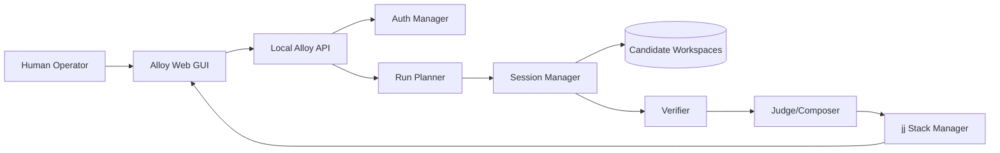
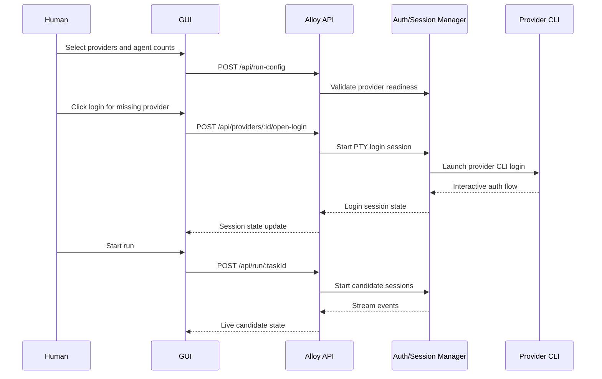

# Runtime And Auth Architecture

This document defines how Alloy should authenticate provider CLIs, choose how many agents to run, and control multiple concurrent CLI sessions from the local API and GUI.

Current implementation note:
- `SessionManager` is now implemented in `src/session-manager.mjs`
- candidate sessions persist records, logs, and event streams
- login launches are recorded as external session events
- `pipe` is the default candidate transport
- `pty` currently uses the system `script` utility rather than a separate PTY dependency
- `jj` and deterministic evaluation now sit downstream of session completion

## Decision Summary

- Use a local Alloy daemon as the control plane.
- Run one isolated session per candidate agent.
- Use PTY-backed subprocesses when a provider needs a TTY.
- Use plain piped subprocesses when a provider supports stable non-interactive output.
- Do not use `tmux` as the primary orchestration mechanism.
- Treat `tmux` as an optional operator attachment/debug tool only.

## Why Not `tmux` As The Control Plane

`tmux` is useful for humans. It is a poor primary API boundary for a production orchestrator.

Problems if `tmux` becomes the control plane:

- pane state is not a robust source of truth
- parsing terminal scrollback is fragile
- session lifecycle becomes shell-dependent
- auth/login flows are harder to reason about
- reconnect and crash recovery get messy
- GUI actions become indirect terminal scripting

Alloy should own session lifecycle directly:

- process ID
- workspace path
- provider profile
- prompt packet
- stdout/stderr or PTY stream
- exit status
- verification status

## Core Runtime Model



## Session Types

Alloy needs two different subprocess modes.

### 1. Login Sessions

Use when:

- a provider needs browser sign-in
- a CLI wants an interactive terminal
- a human needs to repair an expired session

Characteristics:

- PTY required
- human-visible terminal
- launched from GUI via local daemon
- not part of candidate execution history

### 2. Candidate Run Sessions

Use when:

- a provider is actively working on a task
- Alloy needs structured logs and deterministic lifecycle handling

Characteristics:

- isolated workspace
- prompt packet path
- machine-readable event capture if available
- verification on completion
- kill/retry supported

## PTY vs Pipes

Provider adapters should declare what they require.

Suggested adapter contract:

```json
{
  "provider": "claude-code",
  "needs_tty_for_login": true,
  "needs_tty_for_run": false,
  "supports_json_stream": true,
  "supports_noninteractive_prompt": true
}
```

Runtime rule:

- if the provider supports non-interactive execution with structured output, default to pipes
- if the provider requires a TTY for normal execution, run it under a PTY
- if the provider only needs a TTY for login, use PTY only for login repair

## Recommended Implementation

### Backend Control

Use a local `SessionManager` abstraction:

- `createLoginSession(provider, profileId)`
- `createCandidateSession(runId, candidateId, provider, profileId, workspacePath, promptPath)`
- `attachSession(sessionId)`
- `interruptSession(sessionId)`
- `terminateSession(sessionId)`
- `listSessions()`

Each session record should store:

- `session_id`
- `provider`
- `profile_id`
- `mode`
- `transport`
- `pid`
- `workspace_path`
- `status`
- `started_at`
- `completed_at`
- `event_log_path`
- `stdout_path`
- `stderr_path`

### Transport Choice

Use:

- `child_process.spawn()` for piped non-interactive runs
- the system `script` utility for current PTY-backed subprocess execution
- a dedicated PTY library later if the product outgrows the current approach

The GUI/API should not care which transport was chosen.

## GUI And API Control Flow



Current implemented API/UI surfaces:
- `GET /api/providers`
- `POST /api/providers/:id/open-login`
- `GET /api/tasks`
- `GET /api/tasks/:id`
- `GET /api/sessions`
- `POST /api/run/:taskId`

## Provider Selection And Agent Counts

The run form should not assume exactly three sessions forever.

Use a `run_config` object:

```json
{
  "providers": [
    { "provider": "codex", "enabled": true, "agents": 1, "profile_id": "default" },
    { "provider": "gemini", "enabled": true, "agents": 1, "profile_id": "default" },
    { "provider": "claude-code", "enabled": true, "agents": 1, "profile_id": "default" }
  ],
  "mode": "race",
  "judge": "claude-code",
  "max_parallel_candidates": 3
}
```

### First Demo Recommendation

For the first demo:

- one profile per provider
- one agent per provider
- total of three candidate sessions
- judge/composer separate from candidate workers if possible

This keeps the demo legible:

- Candidate A: Codex
- Candidate B: Gemini
- Candidate C: Claude Code

Later expansion:

- multiple agents per provider
- role variants per provider
- provider-specific concurrency caps

## Auth Model

Alloy should model auth honestly. Many CLIs do not expose a reliable "fully authenticated" machine check.

Recommended states:

- `missing_binary`
- `installed_unknown`
- `login_required`
- `ready`
- `expired`
- `degraded`

Rules:

- `installed_unknown` means the CLI exists, but Alloy has not proven a usable login yet
- `ready` means a provider-specific auth/status check succeeded or a recent real run succeeded
- `expired` means a previously working profile failed with an auth-like error

## Profiles

Profiles are needed even in a CLI-only system.

Example:

- `codex/default`
- `claude-code/default`
- `gemini/default`

Future support:

- `claude-code/team`
- `claude-code/personal`
- `codex/pro`

Profile fields:

- `provider`
- `profile_id`
- `display_name`
- `login_state`
- `last_successful_run_at`
- `last_auth_check_at`
- `notes`

## Human Login Repair Flow

The GUI should expose:

- current provider state
- install command if missing
- login command if auth is unknown or invalid
- last successful run time
- most recent auth-related failure

If auto-launch is supported:

- GUI calls local API
- API starts a login PTY session
- GUI shows a small terminal stream or a "terminal launched" status

If auto-launch is not supported:

- GUI shows a copyable command
- user runs the login locally
- GUI polls or refreshes status

## Operator Monitoring

The run dashboard should show:

- provider
- profile
- session mode
- transport type: `pipe` or `pty`
- workspace path
- current phase: `starting`, `running`, `verifying`, `judging`, `synthesizing`
- last event line
- elapsed time
- interrupt button
- attach button for PTY sessions

## API Surface

Suggested endpoints:

- `GET /api/providers`
- `POST /api/providers/:provider/open-login`
- `GET /api/profiles`
- `POST /api/run-config/validate`
- `POST /api/run/:taskId`
- `GET /api/runs/:runId`
- `GET /api/runs/:runId/events`
- `POST /api/sessions/:sessionId/interrupt`
- `POST /api/sessions/:sessionId/terminate`
- `GET /api/sessions/:sessionId/attach`

Use SSE for read-only live updates. Use WebSockets only if the GUI needs to send terminal input back to a PTY.

## Production Guardrails

- default provider concurrency cap of `1` per provider until measured
- global max candidate count to avoid subscription abuse
- backoff when a provider starts returning rate-limit or auth errors
- clear distinction between `provider unavailable` and `candidate failed`
- never let the GUI talk to provider CLIs directly; always route through the local daemon

## Decision

Build the runtime as:

- local Alloy daemon
- provider adapters
- session manager
- PTY when needed
- pipes when possible
- optional `tmux` mirror only for debugging

Do not build the runtime as:

- GUI directly shelling out to CLIs
- `tmux`-pane orchestration
- shell-script-only lifecycle management
